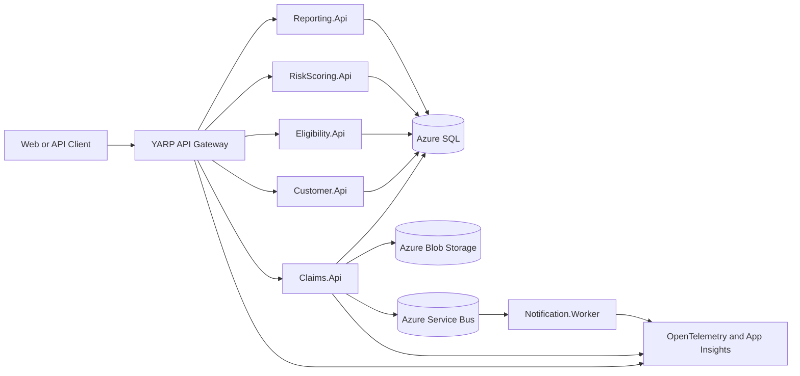

# Enterprise Claims Processing Platform

`dotnet-azure-devops-reference-architecture` is a portfolio-grade reference architecture for an insurance claims platform built with .NET, Azure, Azure DevOps, Bicep, and Codex-assisted engineering practices.

The project is intentionally more than a CRUD sample. It is designed to show how a solution architect would shape service boundaries, security, observability, DevOps, and cloud infrastructure for a realistic enterprise domain while keeping the implementation small enough to understand and evolve release by release.

## Project Goals

- Demonstrate cloud-native .NET service architecture for insurance claims processing.
- Model clear service boundaries for customer, claims, eligibility, risk scoring, reporting, and notifications.
- Show secure-by-default Azure design using JWT, role-based authorization, Managed Identity, and Key Vault.
- Include observable-by-default patterns with structured logging, correlation IDs, OpenTelemetry, health checks, and Application Insights design.
- Use Azure DevOps YAML pipelines and Bicep infrastructure as code.
- Document architecture decisions in a way that is useful to engineers, architects, and recruiters.
- Demonstrate disciplined agentic AI-assisted development using Codex guidance, reusable skills, prompts, and review loops.

## Target Architecture



## Technology Stack

| Area | Preferred Technology |
| --- | --- |
| Backend | ASP.NET Core Web APIs, .NET 10 where available, .NET 8 compatible if needed |
| API Gateway | YARP Reverse Proxy |
| Persistence | EF Core with SQL Server / Azure SQL |
| Messaging | Azure Service Bus abstraction, local in-memory or fake bus for demos |
| Document Storage | Azure Blob Storage abstraction |
| Security | JWT bearer auth, role-based authorization, Managed Identity, Key Vault |
| Observability | Structured logging, correlation IDs, OpenTelemetry, Application Insights |
| DevOps | Azure DevOps YAML pipelines with reusable templates |
| Infrastructure | Bicep modules and environment parameter files |
| Local Development | Docker Compose where useful, no required paid Azure resources for local demos |

## Proposed Repository Structure

```text
EnterpriseClaims.slnx
src/
  ApiGateway/
  Services/
    Customer.Api/
    Claims.Api/
    Eligibility.Api/
    RiskScoring.Api/
    Reporting.Api/
  Workers/
    Notification.Worker/
  Shared/
    BuildingBlocks/
    Contracts/
    Observability/

tests/
  UnitTests/
  IntegrationTests/
  ArchitectureTests/

infra/
  bicep/
    main.bicep
    modules/
    parameters/

pipelines/
  azure-pipelines.yml
  templates/

docs/
  architecture-overview.md
  security-architecture.md
  observability.md
  ci-cd-strategy.md
  deployment-architecture.md
  cost-optimization.md
  disaster-recovery.md
  adr/
```

The repository will grow release by release. Bootstrap documentation exists first so implementation work has a clear architectural north star.

## Release 1 Foundation

Release 1 creates the initial executable foundation:

- `ApiGateway`: YARP reverse proxy with `/health` and routes for Customer and Claims APIs.
- `Customer.Api`: customer boundary with `/health` and `GET /customers/{customerId}`.
- `Claims.Api`: claims boundary with `/health` and `POST /claims`.
- `EnterpriseClaims.Contracts`: DTOs and integration event contracts.
- `EnterpriseClaims.BuildingBlocks`: common API response, error, and validation primitives.
- `EnterpriseClaims.UnitTests`: initial unit tests for claim submission validation.
- `docker-compose.yml`: local startup for the gateway and two APIs.

OpenAPI documents are available in development at each service's `/openapi/v1.json` endpoint.

## Release 2 Data and Messaging

Release 2 adds the first data and messaging slice without requiring cloud resources:

- `Claims.Api` has an EF Core `ClaimsDbContext`, `ClaimRecord` entity, repository, and SQL Server migration setup.
- Local execution uses EF Core InMemory persistence when no `ConnectionStrings:ClaimsDatabase` value is configured.
- SQL Server is the intended provider for deployed environments and local database testing when a developer supplies their own connection string outside source control.
- `EnterpriseClaims.BuildingBlocks` includes a small messaging abstraction and in-memory publisher.
- `ClaimSubmittedEvent` is published after a valid claim submission is persisted.
- `Notification.Worker` consumes a seeded fake/local claim-submitted event to demonstrate the notification boundary.

Real Azure SQL, Azure Service Bus, and durable cross-process messaging are intentionally deferred.

## Run Locally

Restore, build, and test:

```bash
dotnet restore EnterpriseClaims.slnx
dotnet build EnterpriseClaims.slnx
dotnet test EnterpriseClaims.slnx
```

Run services individually:

```bash
dotnet run --project src/Services/Customer.Api/Customer.Api.csproj
dotnet run --project src/Services/Claims.Api/Claims.Api.csproj
dotnet run --project src/ApiGateway/ApiGateway.csproj
dotnet run --project src/Workers/Notification.Worker/Notification.Worker.csproj
```

Run all Release 1 services with Docker Compose:

```bash
docker compose up --build
```

Default local URLs:

| Service | URL |
| --- | --- |
| ApiGateway | `http://localhost:8080` in Docker Compose, `http://localhost:5183` with `dotnet run` |
| Customer.Api | `http://localhost:8081` in Docker Compose, `http://localhost:5065` with `dotnet run` |
| Claims.Api | `http://localhost:8082` in Docker Compose, `http://localhost:5259` with `dotnet run` |
| Notification.Worker | Background worker, no HTTP endpoint |

Sample requests:

```bash
curl http://localhost:8080/health
curl http://localhost:8080/customers/CUST-1001
curl -X POST http://localhost:8080/claims \
  -H "Content-Type: application/json" \
  -d "{\"customerId\":\"CUST-1001\",\"policyNumber\":\"POL-2026-0001\",\"estimatedAmount\":1250.50,\"lossDescription\":\"Water damage to kitchen flooring.\"}"
```

## Release Roadmap

| Release | Focus | Outcome |
| --- | --- | --- |
| 1 | Foundation | Solution structure, initial APIs, shared contracts, local build/test baseline |
| 2 | Data and Messaging | EF Core claims persistence, messaging abstraction, notification worker, local fakes |
| 3 | Security | JWT authentication, RBAC policies, secret-management design |
| 4 | Observability | Correlation IDs, structured logs, OpenTelemetry, health checks |
| 5 | Bicep Infrastructure | Azure Container Apps, SQL, Service Bus, Storage, Key Vault, monitoring modules |
| 6 | Azure DevOps Pipelines | CI/CD templates, build/test/package/deploy stages, smoke checks |
| 7 | Architecture Polish | ADRs, diagrams, review checklist, reliability/cost/disaster recovery docs |

## Agentic AI-Assisted Development

This repository is designed to show how Codex can be used responsibly in a professional engineering workflow.

- `AGENTS.md` defines repository-level working agreements and quality rules.
- `.agents/skills/enterprise-claims-solution-architecture/SKILL.md` gives Codex domain-specific architecture guidance.
- `prompts/` contains release-by-release prompts for controlled, reviewable delivery.
- `docs/codex/` documents rules for architecture, security, DevOps, reviews, and subagent usage.
- Each implementation task should include a plan, small scoped changes, relevant validation, and a Definition of Done summary.

The intent is not to let AI generate a large system blindly. The intent is to demonstrate guided, reviewable, architecture-aware engineering.

## Current Status

Release 2 data and messaging foundation is in place. The repository has a .NET solution, API gateway, Customer API, Claims API, shared contracts/building blocks, EF Core claims persistence setup, messaging abstraction, Notification.Worker, Docker Compose, health checks, OpenAPI documents, and unit tests.

Next recommended step:

```text
Run prompts/03-release-3-security.md
```
