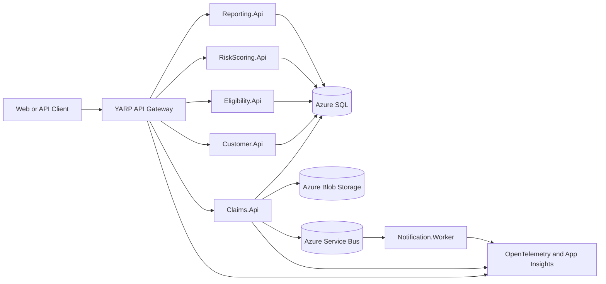

# Enterprise Claims Processing Platform

`dotnet-azure-devops-reference-architecture` is a portfolio-grade reference architecture for an insurance claims platform built with .NET, Azure, Azure DevOps, Bicep, and Codex-assisted engineering practices.

The project is intentionally more than a CRUD sample. It is designed to show how a solution architect would shape service boundaries, security, observability, DevOps, and cloud infrastructure for a realistic enterprise domain while keeping the implementation small enough to understand and evolve release by release.

## Project Goals

- Demonstrate cloud-native .NET service architecture for insurance claims processing.
- Model clear service boundaries for customer, claims, eligibility, risk scoring, reporting, and notifications.
- Show secure-by-default Azure design using JWT, role-based authorization, Managed Identity, and Key Vault.
- Include observable-by-default patterns with structured logging, correlation IDs, OpenTelemetry, health checks, and Application Insights design.
- Use Azure DevOps YAML pipelines and Bicep infrastructure as code.
- Document architecture decisions in a way that is useful to engineers, architects, and recruiters.
- Demonstrate disciplined agentic AI-assisted development using Codex guidance, reusable skills, prompts, and review loops.

## Target Architecture



## Technology Stack

| Area | Preferred Technology |
| --- | --- |
| Backend | ASP.NET Core Web APIs, .NET 10 where available, .NET 8 compatible if needed |
| API Gateway | YARP Reverse Proxy |
| Persistence | EF Core with SQL Server / Azure SQL |
| Messaging | Azure Service Bus abstraction, local in-memory or fake bus for demos |
| Document Storage | Azure Blob Storage abstraction |
| Security | JWT bearer auth, role-based authorization, Managed Identity, Key Vault |
| Observability | Structured logging, correlation IDs, OpenTelemetry, Application Insights |
| DevOps | Azure DevOps YAML pipelines with reusable templates |
| Infrastructure | Bicep modules and environment parameter files |
| Local Development | Docker Compose where useful, no required paid Azure resources for local demos |

## Proposed Repository Structure

```text
src/
  ApiGateway/
  Services/
    Customer.Api/
    Claims.Api/
    Eligibility.Api/
    RiskScoring.Api/
    Reporting.Api/
  Workers/
    Notification.Worker/
  Shared/
    BuildingBlocks/
    Contracts/
    Observability/

tests/
  UnitTests/
  IntegrationTests/
  ArchitectureTests/

infra/
  bicep/
    main.bicep
    modules/
    parameters/

pipelines/
  azure-pipelines.yml
  templates/

docs/
  architecture-overview.md
  security-architecture.md
  observability.md
  ci-cd-strategy.md
  deployment-architecture.md
  cost-optimization.md
  disaster-recovery.md
  adr/
```

The repository will grow release by release. Bootstrap documentation exists first so implementation work has a clear architectural north star.

## Release Roadmap

| Release | Focus | Outcome |
| --- | --- | --- |
| 1 | Foundation | Solution structure, initial APIs, shared contracts, local build/test baseline |
| 2 | Data and Messaging | EF Core persistence, document abstractions, service bus abstraction, local fakes |
| 3 | Security | JWT authentication, RBAC policies, secret-management design |
| 4 | Observability | Correlation IDs, structured logs, OpenTelemetry, health checks |
| 5 | Bicep Infrastructure | Azure Container Apps, SQL, Service Bus, Storage, Key Vault, monitoring modules |
| 6 | Azure DevOps Pipelines | CI/CD templates, build/test/package/deploy stages, smoke checks |
| 7 | Architecture Polish | ADRs, diagrams, review checklist, reliability/cost/disaster recovery docs |

## Agentic AI-Assisted Development

This repository is designed to show how Codex can be used responsibly in a professional engineering workflow.

- `AGENTS.md` defines repository-level working agreements and quality rules.
- `.agents/skills/enterprise-claims-solution-architecture/SKILL.md` gives Codex domain-specific architecture guidance.
- `prompts/` contains release-by-release prompts for controlled, reviewable delivery.
- `docs/codex/` documents rules for architecture, security, DevOps, reviews, and subagent usage.
- Each implementation task should include a plan, small scoped changes, relevant validation, and a Definition of Done summary.

The intent is not to let AI generate a large system blindly. The intent is to demonstrate guided, reviewable, architecture-aware engineering.

## Current Status

Bootstrap documentation is in place. Application code has not been created yet.

Next recommended step:

```text
Run prompts/01-release-1-foundation.md
```
