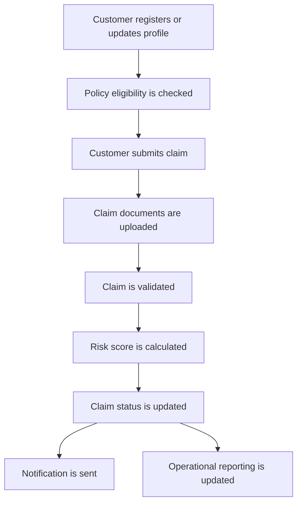
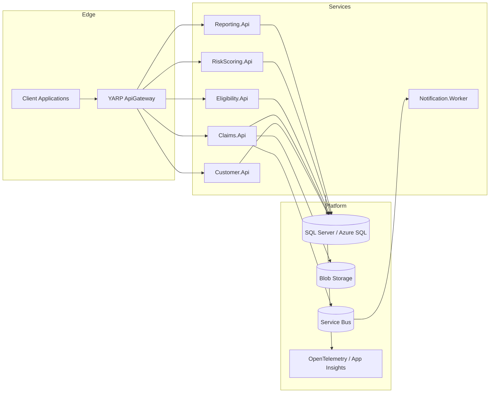

# Architecture Overview

## Purpose

The Enterprise Claims Processing Platform models a realistic insurance claims workflow while staying small enough for portfolio review. It demonstrates service boundaries, cloud-native .NET implementation patterns, Azure design, DevOps automation, infrastructure as code, security, and observability.

## Business Workflow

## Service Boundaries

| Service | Responsibility |
| --- | --- |
| ApiGateway | External API entry point, YARP routing, auth boundary, request correlation |
| Customer.Api | Customer/member profile and contact information |
| Claims.Api | Claim submission, claim lifecycle, document metadata, status changes |
| Eligibility.Api | Policy lookup and eligibility validation |
| RiskScoring.Api | Rules-based risk scoring for submitted claims |
| Reporting.Api | Read-only operational reporting APIs |
| Notification.Worker | Async notification processing from claim events |
| Shared/BuildingBlocks | Cross-cutting primitives such as errors, messaging, storage abstractions |
| Shared/Contracts | DTOs and integration contracts shared at service boundaries |
| Shared/Observability | Correlation, logging, tracing, and health-check helpers |

## Logical Architecture

## Architecture Principles

- Keep controllers or endpoints thin; business rules belong in application/domain services.
- Use DTOs and contracts at service boundaries; do not expose EF entities directly.
- Prefer async APIs and cancellation tokens for request-handling and I/O.
- Keep cross-cutting concerns reusable and centralized.
- Avoid circular dependencies between services.
- Use local fakes or in-memory implementations where Azure resources are not required for development.
- Capture important trade-offs in ADRs.

## Release 1 Scope

Release 1 should create the solution skeleton, initial service projects, shared contracts/building blocks, tests, and a local validation path. It should not attempt to implement the full enterprise platform in one pass.
