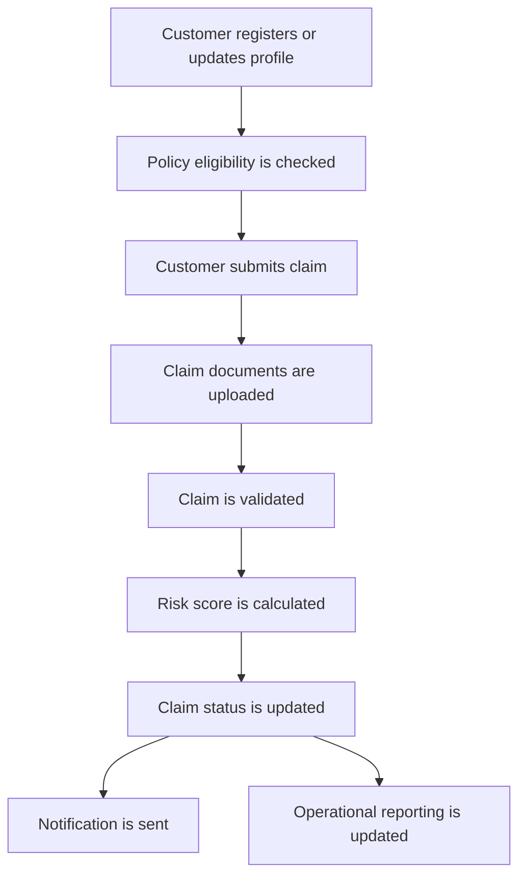
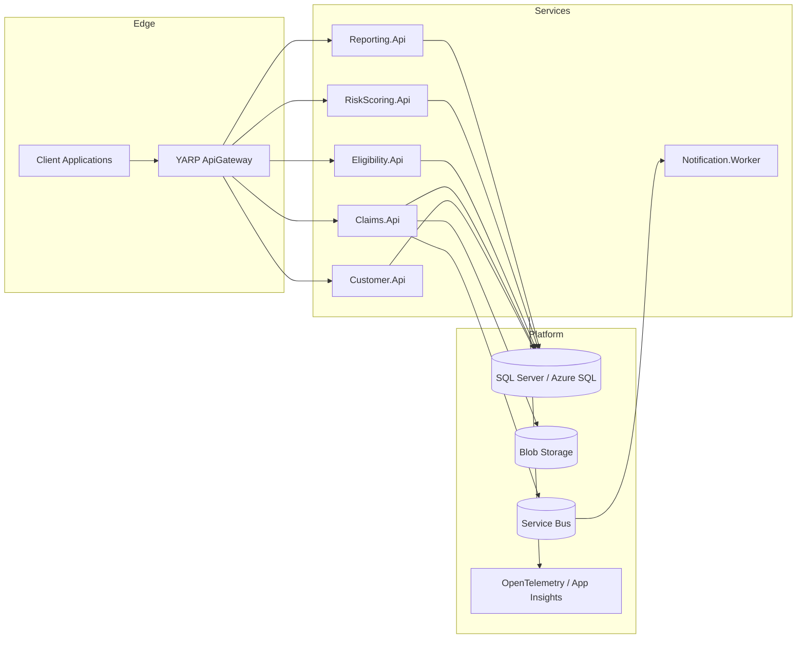
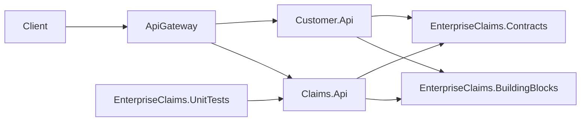
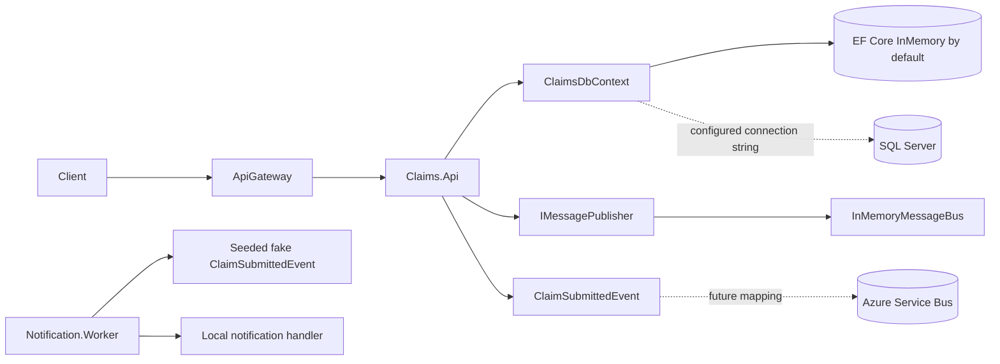
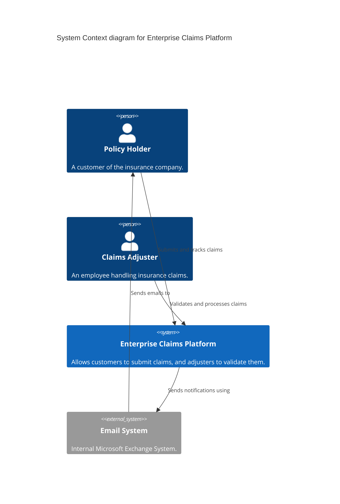
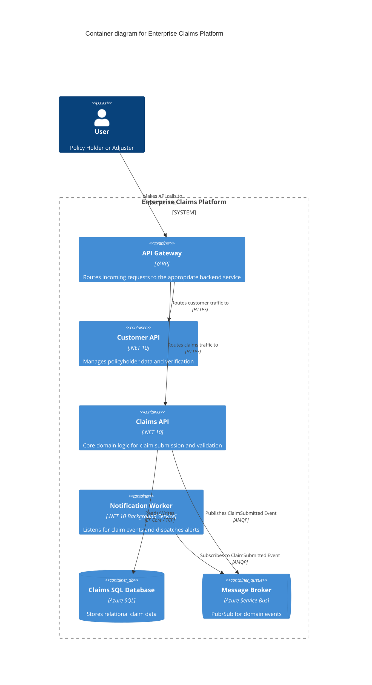

# Architecture Overview

## Purpose

The Enterprise Claims Processing Platform models a realistic insurance claims workflow while staying small enough for portfolio review. It demonstrates service boundaries, cloud-native .NET implementation patterns, Azure design, DevOps automation, infrastructure as code, security, and observability.

## Business Workflow

## Service Boundaries

| Service | Responsibility |
| --- | --- |
| ApiGateway | External API entry point, YARP routing, auth boundary, request correlation |
| Customer.Api | Customer/member profile and contact information |
| Claims.Api | Claim submission, claim lifecycle, document metadata, status changes |
| Eligibility.Api | Policy lookup and eligibility validation |
| RiskScoring.Api | Rules-based risk scoring for submitted claims |
| Reporting.Api | Read-only operational reporting APIs |
| Notification.Worker | Async notification processing from claim events |
| Shared/BuildingBlocks | Cross-cutting primitives such as errors, messaging, storage abstractions |
| Shared/Contracts | DTOs and integration contracts shared at service boundaries |
| Shared/Observability | Correlation, logging, tracing, and health-check helpers |

## Observability

The platform leverages **OpenTelemetry** to export standard logs, metrics, and traces:
- A shared `CorrelationIdMiddleware` ensures a consistent `X-Correlation-ID` flows through logs.
- Azure Application Insights receives this telemetry in production.
- Health checks are implemented at `/health`.

## Logical Architecture

## Current Release 1 Implementation

Release 1 includes only the executable foundation:

- `ApiGateway` uses YARP to route `/customers/{**catch-all}` to Customer.Api and `/claims/{**catch-all}` to Claims.Api.
- `Customer.Api` exposes a health endpoint and one fictional sample customer read endpoint.
- `Claims.Api` exposes a health endpoint and a basic claim submission endpoint.
- `EnterpriseClaims.Contracts` contains DTOs and an initial claim-submitted event contract.
- `EnterpriseClaims.BuildingBlocks` contains common response, error, and validation primitives.
- `EnterpriseClaims.UnitTests` protects the first non-trivial claim validation behavior.
- `docker-compose.yml` starts the gateway and two APIs for local development.

## Current Release 2 Implementation

Release 2 adds:

- EF Core persistence setup in `Claims.Api`.
- A `ClaimRecord` entity and `ClaimsDbContext`.
- SQL Server migration source files for initial claim persistence.
- EF Core InMemory as the default local store when no connection string is configured.
- Shared messaging abstractions in `EnterpriseClaims.BuildingBlocks`.
- Claim submission application service that validates, persists, and publishes `ClaimSubmittedEvent`.
- `Notification.Worker` with a fake/local event consumer for the notification boundary.

Azure SQL and Azure Service Bus are design targets, not required local dependencies in this release.

## System Context

## Architecture Style

The platform follows a modular microservice architecture. Services are logically separated by domain boundaries, enabling independent scaling and deployment.

## Container Diagram

## Architecture Principles

- Keep controllers or endpoints thin; business rules belong in application/domain services.
- Use DTOs and contracts at service boundaries; do not expose EF entities directly.
- Prefer async APIs and cancellation tokens for request-handling and I/O.
- Keep cross-cutting concerns reusable and centralized.
- Avoid circular dependencies between services.
- Use local fakes or in-memory implementations where Azure resources are not required for development.
- Capture important trade-offs in ADRs.
