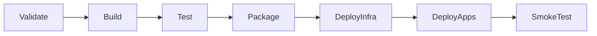

# CI/CD Strategy

## Goals

Azure DevOps pipelines should demonstrate a professional delivery path without requiring paid Azure resources for local development.

## Pipeline Principles

- Use reusable YAML templates under `pipelines/templates/`.
- Separate CI and CD concerns.
- Build and test every pull request.
- Package deployable artifacts or container images from validated builds.
- Deploy infrastructure with Bicep before application deployment.
- Run smoke tests and expose health status after deployment.
- Never hard-code secrets in YAML.

## Proposed Stages

| Stage | Responsibility |
| --- | --- |
| Validate | Restore dependencies, format/lint checks, static analysis placeholders |
| Build | Compile solution and fail fast on warnings where practical |
| Test | Run unit, integration, and architecture tests |
| Package | Build artifacts and container images |
| DeployInfra | Deploy Bicep templates to the target environment |
| DeployApps | Deploy gateway, APIs, and workers |
| SmokeTest | Verify health endpoints and critical API paths |

## Secret Handling

Pipelines should use secure variables, variable groups, service connections, and Key Vault references. Pipeline YAML and parameter files must use placeholders instead of real values.

## Release 1 Scope

Release 1 should establish build/test conventions only if application projects are created. Full Azure DevOps templates can be added in the dedicated pipeline release.
