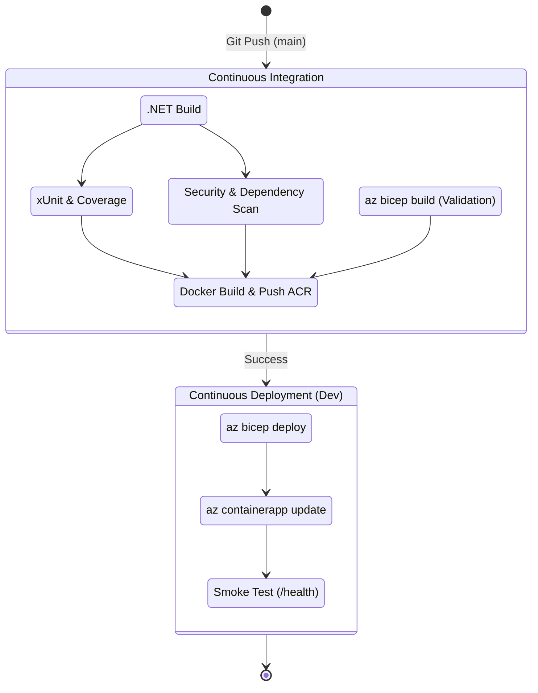

# CI/CD Strategy

This document outlines the Continuous Integration and Continuous Deployment strategy for the Enterprise Claims Processing Platform.

The pipeline architecture is driven primarily by **Azure DevOps YAML Pipelines** (located inside the `pipelines/` directory), with an alternative **GitHub Actions** CI workflow (located in `.github/workflows/ci.yml`) for pull request and main branch validation.

## Pipeline Flow

## Pipeline Architecture

We use a **multi-stage template-driven pipeline**. The orchestration occurs in `pipelines/azure-pipelines.yml`.

### Stage 1: Continuous Integration (CI)
Triggered automatically on commits to the `main` branch.
1. **.NET Build & Test**: Restores, builds, and runs all xUnit tests. Code coverage is gathered and published.
2. **Security Scans**: Analyzes dependencies and triggers vulnerability scanning on the containers.
3. **Docker Build & Push**: Builds the Dockerfile for each microservice and pushes it to Azure Container Registry (ACR), tagged with the Azure DevOps `$(Build.BuildId)`.

### Stage 2: Continuous Deployment (CD)
Triggered upon successful CI completion. Targets the `Development` environment.
1. **Infrastructure Provisioning**: Executes `az deployment group create` using Bicep. It incrementally updates resources (Azure SQL, Service Bus, Container App Environment) to guarantee infrastructure matches code.
2. **App Deployment**: Uses `az containerapp update` to seamlessly push the newly built container images to the active Container Apps.
3. **Smoke Tests**: Reaches out to the public `/health` endpoints to verify the deployment succeeded before considering the stage "Passed".

## Configuration Required

Before the pipeline can run, you must configure the following in your Azure DevOps Organization:

1. **Azure Resource Manager Service Connection**:
   - Named `Azure-ARM-Service-Connection`.
   - Used by the pipeline to deploy Bicep and update Azure resources.
   - Preferably use Workload Identity Federation instead of a raw secret.
2. **Docker Registry Service Connection**:
   - Named `ACR-Service-Connection`.
   - Used by the Docker tasks to authenticate with Azure Container Registry.
3. **Pipeline Environments**:
   - Create an environment named `Development`. This allows tracking deployment history and optionally adding manual approval gates if desired later.
