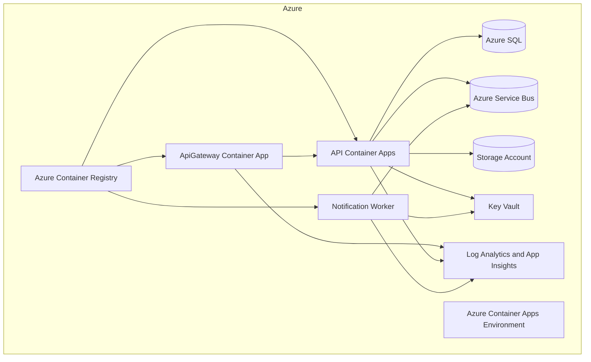

# Deployment Architecture

## Deployment Goals

The deployment architecture should be production-like, cost-aware, and easy to explain. Local development must not require live Azure resources.

## Azure Target Shape

## Preferred Azure Services

| Capability | Azure Service |
| --- | --- |
| Container hosting | Azure Container Apps |
| Image registry | Azure Container Registry |
| SQL persistence | Azure SQL |
| Async messaging | Azure Service Bus |
| Document storage | Azure Storage Account / Blob Storage |
| Secrets | Azure Key Vault |
| Observability | Log Analytics and Application Insights |

## Infrastructure as Code

Bicep is the default IaC tool. Modules should be small, reusable, and environment-aware. Initial parameter files should target `dev` with cost-conscious defaults and placeholder tags such as `project`, `environment`, `owner`, and `costCenter`.

Terraform should only be introduced if explicitly requested.

## Local Development

Local development should prefer:

- Local SQL Server or containerized SQL Server when persistence is introduced.
- In-memory or fake messaging before Azure Service Bus is wired.
- Local file or fake storage before Azure Blob Storage is required.
- Docker Compose only after there are service projects worth composing.

## Release 1 Scope

Release 1 should prepare the solution for future deployment without creating Bicep resources yet. Bicep modules belong in the dedicated infrastructure release.
