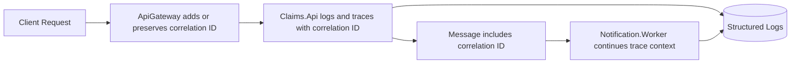

# Observability

## Goals

The platform should be observable by default so engineers can understand request flow, service health, failures, and operational behavior.

## Core Signals

| Signal | Approach |
| --- | --- |
| Logs | Structured logs with correlation IDs and no sensitive claim data |
| Traces | OpenTelemetry traces across gateway, APIs, workers, persistence, and messaging |
| Metrics | Request duration, error counts, queue processing, document operations, dependency timing |
| Health | Liveness/readiness checks for APIs, workers, SQL, storage, and messaging dependencies |
| Dashboards | Application Insights and Azure Monitor views in production design |

## Correlation

Every inbound request should receive or preserve a correlation ID. The ID should flow through:

- API Gateway routing.
- Service-to-service calls.
- Message publishing and consumption.
- Structured logs and traces.

## Sensitive Data Rules

Logs and telemetry must not include:

- Claim document content.
- Authentication tokens.
- Passwords or connection strings.
- Sensitive customer/member details.
- Raw policy or medical information.

Use stable identifiers, event names, status values, and high-level workflow states instead.

## Future Application Insights Queries

When Application Insights is added, this document should include example KQL queries for:

- Failed requests by service.
- Long-running claim submissions.
- Queue processing failures.
- Dependency latency against SQL, storage, and messaging.
- Correlation ID trace lookup.
