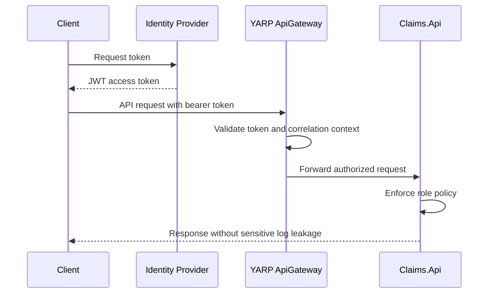

# Security Architecture

## Security Goals

The platform should be secure by default while remaining practical for local development and portfolio review.

- Authenticate API callers with JWT bearer tokens.
- Authorize operations through role-based policies.
- Avoid storing or logging secrets and sensitive insurance data.
- Use Managed Identity and Key Vault in production Azure design.
- Validate input at API boundaries.
- Keep sample data fictional.

## Security Boundaries

```mermaid
graph TD
    Client[External Client]

    subgraph "Azure VNet (Planned)"
        Gateway[API Gateway (YARP)]

        subgraph "Application Subnet"
            Claims[Claims API]
            Customer[Customer API]
        end

        subgraph "Data Subnet"
            SQL[(Azure SQL)]
            KV>Key Vault]
        end
    end

    Client -- HTTPS (JWT) --> Gateway
    Gateway -- HTTPS --> Claims
    Gateway -- HTTPS --> Customer

    Claims -- Managed Identity --> SQL
    Claims -- Managed Identity --> KV
```

## Identity and Access Management (IAM)

## Roles

| Role | Example Capabilities |
| --- | --- |
| Customer | Submit claims, view own claim status, upload supporting documents |
| ClaimProcessor | Review submitted claims and update workflow status |
| Supervisor | Override or approve higher-risk decisions |
| Admin | Manage operational configuration and system-level access |

## Authentication & Authorization

The platform uses **JWT Bearer Authentication** to verify identities and **Role-Based Authorization Policies** to enforce access control.

### Identity Provider
- **Local Development**: We use a basic symmetric-key JWT configuration. A local script or tool can generate a signed token using a placeholder secret from `appsettings.Development.json`.
- **Production**: The application will integrate with **Microsoft Entra ID**. The API Gateway or downstream services validate the Entra ID tokens.

### Roles and Policies
The following policies are defined across all APIs using a shared `AddEnterpriseSecurity` extension:
- `Customer`: Can view their own claims and submit new claims.
- `ClaimProcessor`: Can view all claims and update claim status.
- `Supervisor`: Can override risk scores and approve high-value claims.
- `Admin`: Can manage system configuration and all operational aspects.

- Managed Identity for Azure resource access.
- Key Vault references for secrets and certificates.
- Secure pipeline variables or variable groups for deployment-time configuration.

No connection strings, keys, tokens, passwords, certificates, tenant IDs, or subscription IDs should be committed.

## Data Protection

Insurance claims may contain sensitive personal and policy information. The design should:

- Avoid logging PII, document content, tokens, passwords, or connection strings.
- Store documents through a blob storage abstraction.
- Use least-privilege access to SQL, storage, and messaging resources.
- Prefer private networking and managed identities in production Azure deployments.

## API Security Flow



## Initial Security Decisions

- Use JWT bearer authentication for demo application security.
- Use role-based authorization policies for claims workflows.
- Design Azure access around Managed Identity and Key Vault.
- Defer detailed network isolation until the Bicep infrastructure release.
