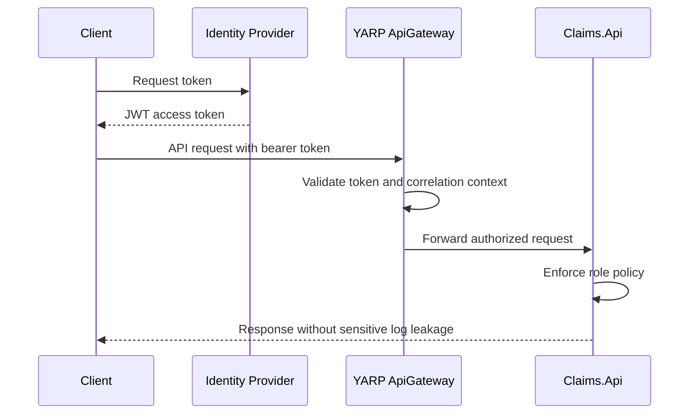

# Security Architecture

## Security Goals

The platform should be secure by default while remaining practical for local development and portfolio review.

- Authenticate API callers with JWT bearer tokens.
- Authorize operations through role-based policies.
- Avoid storing or logging secrets and sensitive insurance data.
- Use Managed Identity and Key Vault in production Azure design.
- Validate input at API boundaries.
- Keep sample data fictional.

## Roles

| Role | Example Capabilities |
| --- | --- |
| Customer | Submit claims, view own claim status, upload supporting documents |
| ClaimProcessor | Review submitted claims and update workflow status |
| Supervisor | Override or approve higher-risk decisions |
| Admin | Manage operational configuration and system-level access |

## Identity and Secret Management

Local development may use placeholder JWT settings and local user secrets where needed. Production design should rely on:

- Microsoft Entra ID or equivalent identity provider for token issuance.
- Managed Identity for Azure resource access.
- Key Vault references for secrets and certificates.
- Secure pipeline variables or variable groups for deployment-time configuration.

No connection strings, keys, tokens, passwords, certificates, tenant IDs, or subscription IDs should be committed.

## Data Protection

Insurance claims may contain sensitive personal and policy information. The design should:

- Avoid logging PII, document content, tokens, passwords, or connection strings.
- Store documents through a blob storage abstraction.
- Use least-privilege access to SQL, storage, and messaging resources.
- Prefer private networking and managed identities in production Azure deployments.

## API Security Flow

## Initial Security Decisions

- Use JWT bearer authentication for demo application security.
- Use role-based authorization policies for claims workflows.
- Design Azure access around Managed Identity and Key Vault.
- Defer detailed network isolation until the Bicep infrastructure release.
